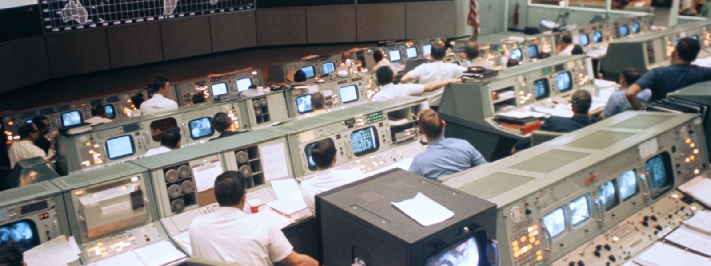

<p align="center">
  
</p>

# Wake Up To The State Of The Room

Your agents are moving. Your projects are moving. Your decisions are scattered across chat, repos, and half-finished handoffs.

`chief-of-staff` gives you the one thing every agent-heavy workflow starts missing: a current operating picture.

Not another task runner. Not another chat personality. The agent that keeps the room legible so you can see what matters before the day steals your focus.

## The Moment It Clicks

You open one report and know:

- what changed while you were away;
- which project is actually blocked;
- which agent needs a handoff;
- which decision is holding up other work;
- what can keep moving without you.

That is the pitch. Less excavation. More judgment.

## Before And After

| Before | After |
| --- | --- |
| You ask three agents for status. | The operating picture already names the state of the room. |
| Decisions live wherever they were discussed. | Decisions have a visible place and a current status. |
| Blockers age quietly. | Blockers surface with owners and impact. |
| You rebuild context every morning. | The day starts from a clear read. |

## Best For

People running more agent work than they can comfortably hold in working memory.

If your main pain is code implementation, use an implementer. If your main pain is the fog around implementation, use this.

## What It Feels Like

Less """where did that land?"""

Less """did we decide this already?"""

Less """why is this still stuck?"""

More """here are the two calls that need you today."""

## Install

```bash
npx awesome-agents add pablof7z/touch-grass --agent chief-of-staff --harness tenex-edge
```

Banner source: see [`banner-source.md`](banner-source.md).
