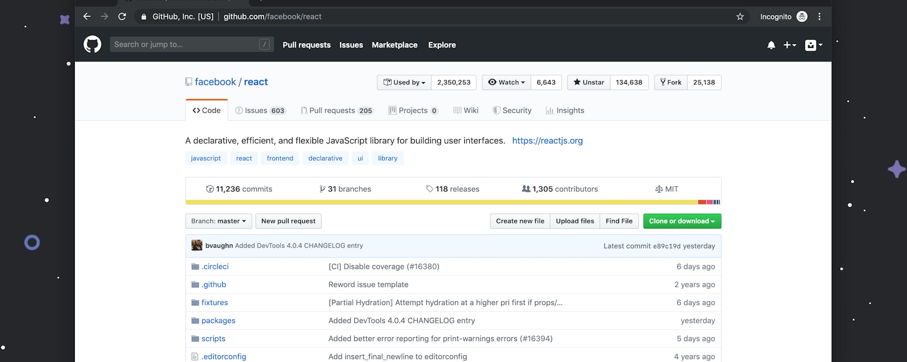

<p align="center">
  
</p>

<p align="center">
  <strong>Chief Of Staff</strong><br />
  <em>Make GitHub the place your agent system remembers.</em>
</p>

# Chat Is Not An Office

Chat is where work starts. It is a terrible place for work to live.

Decisions vanish. Blockers scroll away. Agents link artifacts once, then everyone forgets where the truth landed.

`chief-of-staff` turns GitHub into the durable operating surface for agent work: not by dumping process everywhere, but by keeping the few living records that make the whole system easier to trust.

## The Feeling

You open the repo and know where the work stands.

No archaeology.

No """wait, which thread was that in?"""

No status theater.

## What GitHub Becomes

| Instead of... | You get... |
| --- | --- |
| Chat as memory | Files that survive the conversation |
| Status updates as vibes | A current operating read |
| Decisions in transcripts | Decisions with a place to live |
| Agents as loose actors | Agents tied to repos, work, and next steps |

## Why You Want This

Because serious agent work needs a room.

Not a dashboard for dashboard""'s sake. A room where decisions, blockers, reports, and handoffs can sit long enough for the next person or agent to understand them.

If your agent setup is starting to feel powerful but slippery, this is the missing surface.

## Best Fit

Use this direction if GitHub already feels like the center of your work and you want agents to leave state where the work actually happens.

## Install

```bash
npx awesome-agents add pablof7z/touch-grass --agent chief-of-staff --harness tenex-edge
```

Banner source: see [`banner-source.md`](banner-source.md).
